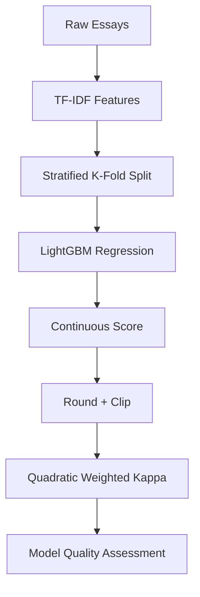

# Ordinal Modeling Notes — TF-IDF + LightGBM (AES Case Study)

This document captures the **core learning concepts** behind an Automated Essay Scoring (AES) baseline and is intended as a **long-term reference** for any **ordinal prediction problem** (ratings, grades, severity levels).

---

## 1. Problem Type Clarification (Most Important Insight)

Although the target variable is an integer (`1–6`), this task is **not a standard multiclass classification problem**.

### Correct problem type: Ordinal Regression

Because:
- Labels have a **natural order**
- Distance between labels matters
- Errors are not equally severe

```
1 < 2 < 3 < 4 < 5 < 6
```

Predicting `3 → 4` is far less wrong than `3 → 6`.

---

## 2. Why LightGBM is Used as Regression (Not Classification)

### Why Multiclass Classification is Incorrect Here

Multiclass classification assumes:
- Classes are unordered
- All misclassifications are equally wrong

| True | Pred | Penalty |
|----|----|----|
| 3 | 4 | ❌ |
| 3 | 6 | ❌ |
| 3 | 1 | ❌ |

This directly contradicts the task semantics.

---

### Why Regression is Correct for Ordinal Targets

Regression learns a **continuous latent score**:

```
ŷ ∈ ℝ
```

Then:
```
ŷ → round → clip → {1,2,3,4,5,6}
```

This allows the model to:
- Learn ordering naturally
- Penalize distant errors more
- Align with ordinal evaluation metrics

**Key mental shift**  
> Integer labels ≠ classification  
> Ordered labels ⇒ regression or ordinal modeling

---

## 3. Why TF-IDF (Word + Character N-grams)

### Word-level TF-IDF
- Captures semantic content
- Models phrase-level meaning
- Strong baseline for long-form text

### Character-level TF-IDF
- Captures spelling, punctuation, fluency
- Robust to typos and stylistic variation
- Especially effective for writing-quality tasks

### Combined Representation

```
[ Word semantics ] + [ Character-level style ]
```

This combination is a well-established best practice in AES systems.

---

## 4. Why Stratified K-Fold Cross-Validation

Essay score distributions are often **imbalanced**.

Stratified K-Fold ensures:
- Each fold preserves label distribution
- Validation metrics are stable and reliable
- Rare scores are represented in every fold

Without stratification:
- QWK becomes noisy
- Validation scores become misleading

---

## 5. What is Cohen’s Kappa?

Cohen’s Kappa measures **agreement beyond chance**.

### Why accuracy is insufficient

If 40% of essays have score `4`, a model that always predicts `4` gets:

```
Accuracy ≈ 40%
```

Yet it has learned nothing.

---

### Cohen’s Kappa (Intuition)

```
Kappa = (Observed Agreement − Expected Agreement)
        / (1 − Expected Agreement)
```

| Kappa | Interpretation |
|----|----|
| 1.0 | Perfect agreement |
| 0.0 | Random guessing |
| < 0 | Worse than random |

---

## 6. Why Quadratic Weighted Kappa (QWK)

Standard Kappa treats all errors equally.

QWK applies **distance-aware penalties**:

```
Penalty ∝ (|i − j|)²
```

| True | Pred | Penalty |
|----|----|----|
| 4 | 5 | Small |
| 4 | 6 | Large |
| 4 | 1 | Very Large |

### Why QWK is ideal for ordinal tasks
- Respects label ordering
- Penalizes large errors more heavily
- Closely matches human grading intuition

QWK is widely used in:
- Essay scoring systems
- Educational assessment
- Kaggle ordinal competitions

---

## 7. Why RMSE for Training but QWK for Evaluation

- **RMSE** provides smooth gradients for optimization
- **QWK** reflects real-world task quality

This separation is intentional:
- Train with a stable loss function
- Evaluate with a domain-correct metric

---

## 8. End-to-End Mental Model



---

## 9. Reusable Takeaways

- Ordinal problems are not multiclass problems
- Regression can model ordered labels better than softmax
- Evaluation metric should define modeling strategy
- QWK is superior to accuracy for ordered targets
- Distance-aware errors matter more than exact class match

---

## 10. When to Reuse This Pattern

Use this modeling pattern for:
- Essay or answer grading
- Rating prediction (1–5, 1–10)
- Severity or risk scoring
- Any NLP task with **ordered labels**

---

**Core lesson:**  
> Always model the *structure of the label space*, not just the datatype.
