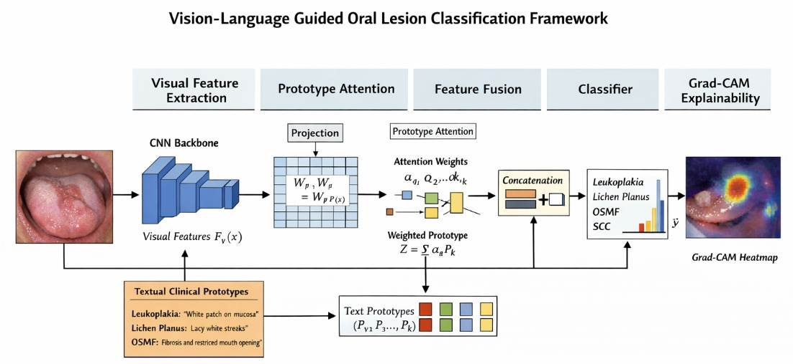

# VLGOLCF — Vision Language Guided Oral Lesion Classification Framework

> A lightweight multimodal deep learning framework for automated classification of six oral mucosal conditions, combining MobileNetV2 visual features with frozen clinical language prototypes via soft cosine attention.

---

## Architecture



The framework processes a clinical oral image through five stages:
1. **Visual Feature Extraction** — MobileNetV2 backbone produces a 1280-dim feature vector
2. **Prototype Attention** — A low-rank bottleneck (1280 → 16 → 384) projects visual features into language space; soft cosine attention is computed over frozen class text prototypes
3. **Feature Fusion** — Visual features and the attended language prompt are concatenated (1664-dim)
4. **Classification** — A lightweight MLP head predicts one of six oral conditions
5. **Grad-CAM Explainability** — Gradient-weighted heatmaps highlight diagnostically relevant lesion regions

---

## Supported Classes

| Class | Clinical Risk |
|---|---|
| Normal Mucosa | Benign |
| Aphthous Ulcer | Benign |
| Lichen Planus | Potentially malignant |
| Leukoplakia | Pre-malignant |
| OSMF (Oral Submucous Fibrosis) | Pre-malignant |
| Squamous Cell Carcinoma (SCC) | Malignant |

---

## Results

| Metric | Score |
|---|---|
| Test Accuracy | **98%** |
| Dataset Size | 1,299 images (6 classes) |
| Train / Val / Test Split | 70 / 15 / 15 (stratified) |

---

## Installation

```bash
git clone https://github.com/your-username/vlgolcf.git
cd vlgolcf
pip install -r requirements.txt
```

**Key dependencies:**
```
torch
torchvision
sentence-transformers
scikit-learn
Pillow
matplotlib
pandas
```

---

## Usage

### Training

```bash
# Set your dataset path in the script
BASE_PATH = "/path/to/your/data"   # folder-per-class structure

python train.py
```

Expected folder structure:
```
data/
├── Leukoplakia/
├── Normal Mucosa/
├── Squamous cell carcinoma/
├── Apthous Ulcer/
├── osmf/
└── Lichen planus/
```

### Inference on External Test Set

```bash
python test.py \
  --checkpoint artifacts/cilmp_dental_v3.pt \
  --test_dir /path/to/external/test
```

---

## Model Checkpoint

The checkpoint saves everything needed for inference — no SentenceTransformer required at test time:

```python
{
  "model_state_dict": ...,
  "class_text_embeds": ...,   # frozen (6, 384) prototype matrix
  "classes": [...],
  "r": 16,
  "text_dim": 384
}
```

---

## Citation

If you use this work, please cite:

```bibtex
@article{vlgolcf2025, TBA
}
```

This work draws conceptual inspiration from:

```bibtex
@article{du2025cilmp,
  title   = {Medical Knowledge Intervention Prompt Tuning for Medical Image Classification},
  author  = {Du, Ye and Yu, Nanxi and Wang, Shujun},
  journal = {IEEE Transactions on Medical Imaging},
  year    = {2025}
}
```

---

## License

MIT License
