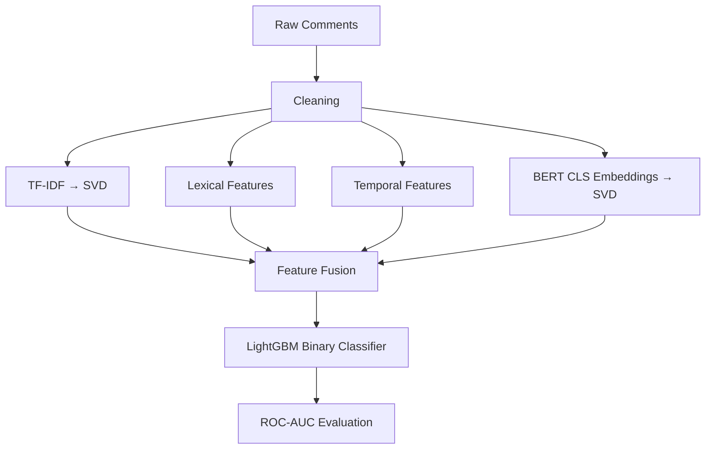

# Multi-Modal Text Classification — LightGBM (Insult Detection)

This document explains the **reasoning and learning concepts** behind a multi-modal LightGBM pipeline used for an **insult detection (binary classification)** task.  
The focus is on *why* each technique is used, so this can serve as a **reusable reference** for future NLP competitions and interviews.

---

## 1. Problem Framing

**Task type:** Binary classification  
**Target:** `Insult ∈ {0, 1}`  
**Evaluation metric:** ROC-AUC  

### Why ROC-AUC?
- Class distributions are often imbalanced
- Threshold-independent evaluation
- Measures ranking quality rather than raw accuracy

> Mental model:  
> *“How well does the model rank insulting comments above non-insulting ones?”*

---

## 2. Why a Multi-Modal Feature Strategy

Single feature types rarely capture all linguistic signals.

This pipeline intentionally combines:

1. **Semantic meaning** (BERT embeddings)
2. **Surface lexical cues** (TF-IDF, capitalization, punctuation)
3. **Stylistic intensity** (length, caps ratio, exclamation marks)
4. **Contextual metadata** (temporal features)

> Insults are often short, emotional, capitalized, and context-dependent.

---

## 3. Text Cleaning (Minimal but Safe)

The `clean_comment` function:
- Removes surrounding quotes
- Normalizes escaped characters
- Preserves original casing and punctuation

### Why not aggressive cleaning?
- Capital letters and punctuation are **signal**, not noise
- Over-cleaning hurts insult detection performance

---

## 4. TF-IDF + TruncatedSVD (Dense Semantic Compression)

### Why TF-IDF?
- Strong baseline for text classification
- Captures keyword-level toxicity cues
- Interpretable and fast

### Why TruncatedSVD?
- Reduces sparse TF-IDF into dense vectors
- Improves LightGBM efficiency
- Acts as a linear semantic projection

```
Sparse TF-IDF (20k) → Dense semantic space (100)
```

This keeps the signal while controlling dimensionality.

---

## 5. Lexical Features (Human-Like Signals)

Extracted features:
- Text length
- Capital letter ratio
- Number of `!`
- Number of `?`

### Why these matter
- Insults often contain shouting (ALL CAPS)
- Emotional emphasis (`!!!`, `???`)
- Short, sharp phrasing

These features are **low-cost, high-impact**.

---

## 6. Temporal Features (Behavioral Context)

Extracted from timestamps:
- Hour of day
- Day of week
- Month

### Why include time?
- Toxic behavior can correlate with time patterns
- Certain hours/days show higher aggression rates

Missing or malformed dates are safely handled.

---

## 7. BERT CLS Embeddings (Frozen)

### Why BERT?
- Captures deep semantic and contextual meaning
- Understands phrasing beyond keywords

### Why frozen?
- Avoids expensive fine-tuning
- Prevents overfitting on small datasets
- Embeddings act as **semantic features**, not a classifier

### Why CLS token?
- Standard sentence-level representation
- Compact summary of entire input

---

## 8. Dimensionality Reduction on BERT Embeddings

```
768-dim CLS → 100-dim via TruncatedSVD
```

### Why?
- LightGBM performs better with moderate feature sizes
- Reduces noise and redundancy
- Keeps training fast and stable

---

## 9. Feature Assembly and Scaling

Final feature matrix:

```
[ TF-IDF SVD | Lexical | Temporal | BERT SVD ]
```

### Why scaling?
- Helps PCA/SVD-reduced features
- Improves numerical stability
- Not mandatory for trees, but beneficial in mixed-feature setups

---

## 10. Why LightGBM for Final Model

LightGBM excels at:
- Mixed feature types
- Non-linear interactions
- Tabular + embedding fusion
- Fast training with early stopping

> Mental model:  
> *“Let trees decide how to combine semantic, lexical, and contextual signals.”*

---

## 11. Stratified K-Fold Cross-Validation

### Why stratification?
- Preserves class balance in each fold
- Prevents misleading AUC scores
- Improves generalization estimates

Each fold:
- Trains independently
- Uses early stopping
- Contributes to test prediction averaging

---

## 12. Early Stopping and Best Iteration Averaging

Early stopping:
- Prevents overfitting
- Automatically selects optimal tree depth

Final model uses:
- Mean of best iterations across folds

This stabilizes final training.

---

## 13. End-to-End Mental Model



---

## 14. Reusable Takeaways

- Multi-modal features outperform single representations
- BERT embeddings work well as frozen features
- Tree models are excellent feature fusers
- TF-IDF is still a strong baseline
- Metadata and lexical cues matter in toxicity tasks

---

## 15. When to Reuse This Pattern

This pipeline is suitable for:
- Toxicity / insult detection
- Hate speech classification
- Spam detection
- Any short-text binary NLP task

---

**Core lesson:**  
> Combine *semantic depth* with *human-intuitive signals* and let trees learn the interactions.
